<div align="center">
  <!-- Logo Placeholder -->
  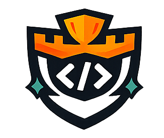

  <h1>CodeArena</h1>
  
  <p><strong>Real-time Coding Battle Platform for Interview Preparation.</strong></p>
  
  <p>
    CodeArena is a modern coding interview practice platform where developers can challenge each other in real-time coding battles.
  </p>

  <!-- Badges -->
  <p>
    
    
    
    
    
    
    
    
    
    
    
    
  </p>

  <br />
  
</div>

<hr />

## ✨ Features

- 🔐 **Secure Authentication**: Support for Google OAuth and JWT-based email/password login.
- ⚔️ **Live Battle Rooms**: Create or join isolated battle rooms with unique invite links.
- ⚡ **Realtime Socket.IO**: Live opponent progress, presence, chat, and instant match verdicts.
- 🏆 **Dynamic Leaderboards**: Real-time rank calculation based on performance and win streaks.
- 🐳 **Sandboxed Code Execution**: Dockerized Piston API runs multiple languages securely in absolute isolation.
- 📱 **Responsive UI**: Pixel-perfect responsive design tailored for web, tablet, and mobile displays.
- 🍪 **Secure Cookies**: Utilizing HTTP-only and secure cookies to prevent XSS attacks.
- 🏎️ **Redis Cache & Pub/Sub**: High-performance scaling for WebSocket events across multiple nodes.
- 🗄️ **MongoDB**: Scalable NoSQL database with optimized indexes for ultra-fast queries.
- 🛡️ **Advanced Security**: Rate Limiting, Helmet headers, CORS policies, and strictly validated Zod schemas.
- 📜 **Battle History**: Detailed logs and analytics for past coding challenges to track interview prep progress.
- 🚀 **Production-Ready Deployment**: Orchestrated via Docker Compose, served behind an Nginx reverse proxy on an AWS EC2 instance.

---

## 🛠 Tech Stack

CodeArena is built utilizing industry-leading technologies to guarantee scalability, performance, and maintainability.

| Category | Technologies | Description |
| :--- | :--- | :--- |
| **Frontend** | Next.js, React, TypeScript, TailwindCSS, Framer Motion, Zustand | Blazing fast CSR/SSR interface built for scale. |
| **Backend** | Node.js, Express.js, TypeScript, Zod | Robust, strictly-typed REST API layer. |
| **Database** | MongoDB (Mongoose), Redis | Persistent storage mapped with quick caching layers. |
| **Realtime** | Socket.IO, Redis Pub/Sub | Full-duplex communication with multi-node sync capability. |
| **Authentication** | JWT, Google OAuth, Bcrypt | Multi-strategy secure auth with Refresh/Access token rotation. |
| **Code Execution**| Piston API (Docker) | Self-hosted, heavily restricted sandbox to safely run untrusted code. |
| **DevOps** | Docker, Docker Compose, Nginx, Let's Encrypt | Immutable infrastructure setups with secure reverse proxying. |
| **Deployment** | Vercel (Frontend), AWS EC2, PM2 | Highly available deployment architecture. |

---

## 🏗 Architecture

CodeArena employs a robust microservices-inspired architecture designed to gracefully handle heavy traffic spikes and maintain low-latency Websocket connections.

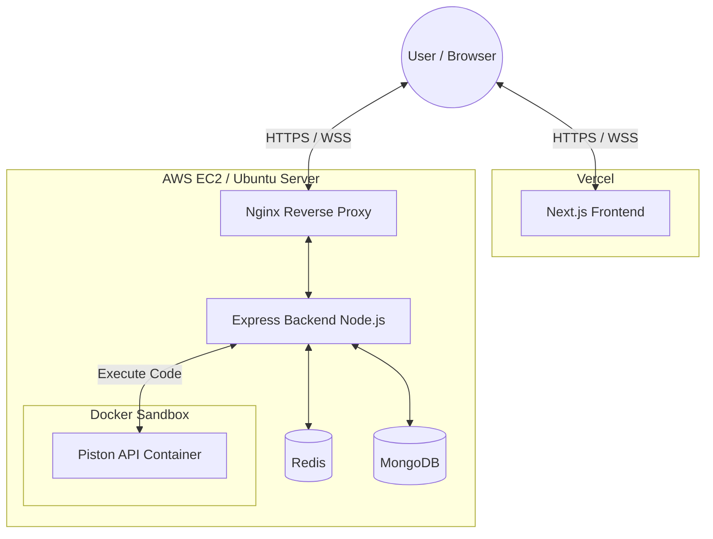

---

## 📂 Folder Structure

```bash
codearena/
├── frontend/             # Next.js application
│   ├── src/
│   │   ├── app/          # App router pages (status, battle, etc.)
│   │   ├── components/   # Reusable UI components (Shadcn/UI, Base-UI)
│   │   ├── lib/          # Utility functions and API client
│   │   └── stores/       # Zustand state management
│   ├── public/           # Static assets
│   └── package.json
├── backend/              # Express Node.js application
│   ├── src/
│   │   ├── controllers/  # Route logic
│   │   ├── models/       # Mongoose schemas
│   │   ├── routes/       # Express routes definition
│   │   ├── sockets/      # Socket.io event handlers
│   │   └── utils/        # Shared utilities
│   ├── Dockerfile
│   └── package.json
├── docker/               # Docker configurations
│   └── nginx/            # Nginx config files
├── docker-compose.yml    # Local development container orchestration
├── docs/                 # Documentation and assets (images, diagrams)
└── docker-compose.prod.yml # Production container orchestration
```

---

## 🔐 Authentication Flow

We enforce a highly secure, stateless authentication flow with token rotation to ensure users remain securely authenticated across devices.

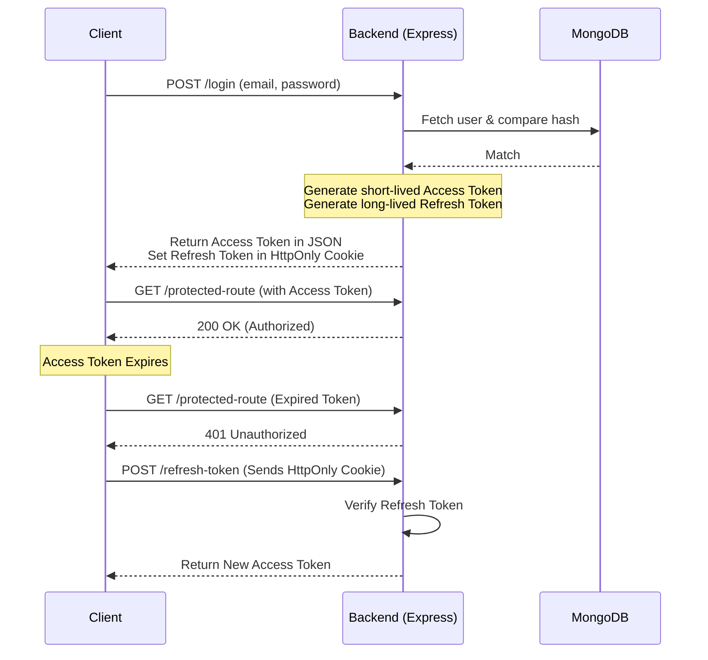

---

## ⚡ Realtime Flow

The heart of CodeArena is the real-time syncing of the coding battle environment, managed via Socket.IO and the Redis Adapter.

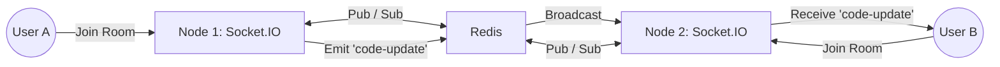

- **Battle Updates:** Code edits and cursor movements sync seamlessly.
- **Leaderboard:** Dynamic shifts in rank emitted to all clients on submission success.
- **Presence:** Active users online/offline detection.
- **Room Events:** Start, timer countdown, forfeit, and end-match syncing.

---

## 💻 Code Execution Flow

Security is paramount when running untrusted user code. We self-host the **Piston API** in an isolated Docker container with zero network access and restricted CPU/Memory resources.

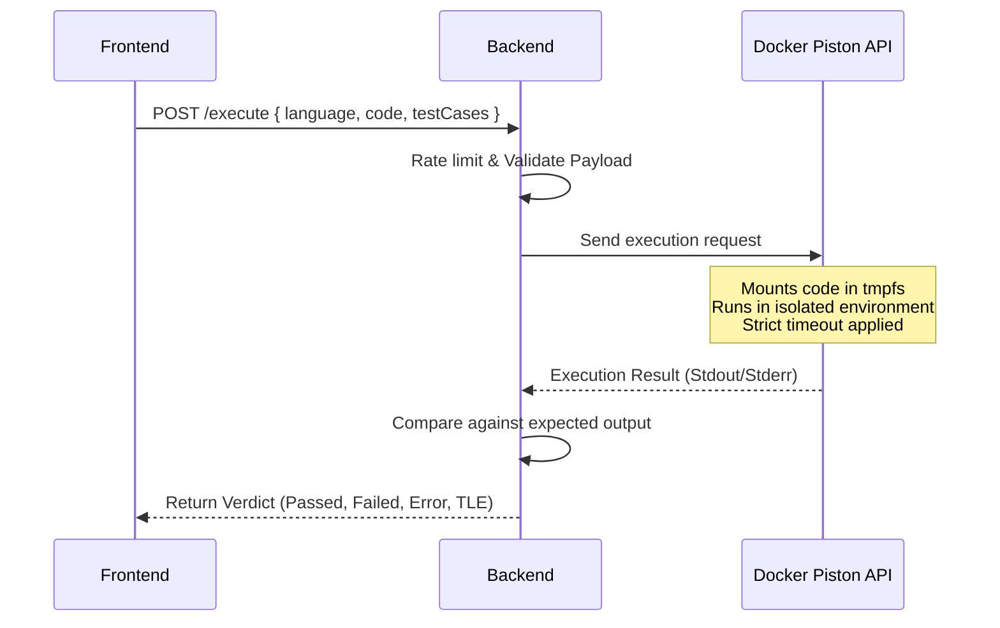

**Why self-hosted Piston?**
Using a public execution API incurs latency and strict rate limits. Self-hosting allows unlimited scaling, absolute zero data leakage, and total environment control (sandbox security).

---

## 🚀 Deployment

The platform is deployed using a standard load-balanced web architecture, utilizing Docker for consistency from development to production.

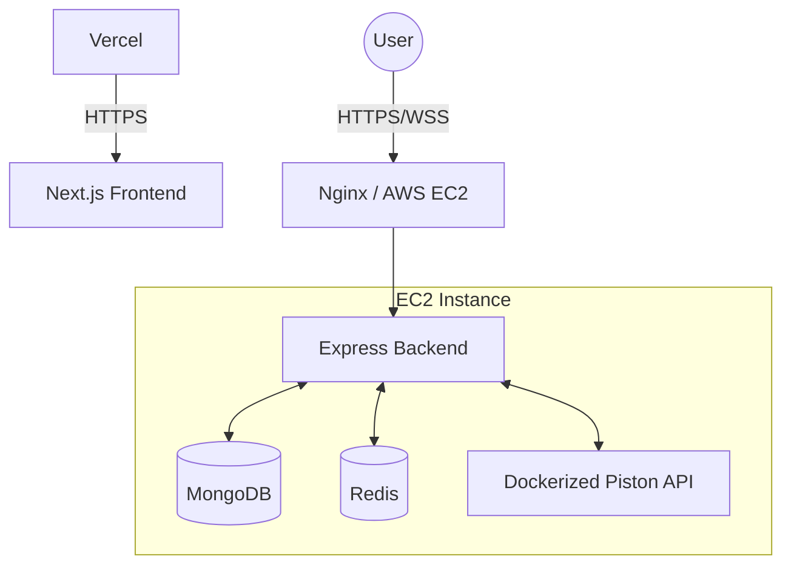

**Infrastructure Overview:**
- **Frontend**: Hosted globally on Vercel's Edge Network for immediate static delivery.
- **Backend**: Hosted on an AWS EC2 instance running Ubuntu Server.
- **Nginx Reverse Proxy**: Forwards requests from 80/443 to the backend process and serves as an SSL termination point.
- **Docker & PM2**: Backend runs optimally scaled with containerized dependencies (MongoDB, Redis, Piston).

---

## 💻 Local Development

### Prerequisites
- Node.js (v18+)
- Docker and Docker Compose
- Git

### 1. Clone the repository
```bash
git clone https://github.com/yourusername/codearena.git
cd codearena
```

### 2. Environment Variables
Create `.env` files in both the frontend and backend directories.
- Copy `backend/.env.sample` to `backend/.env`
- Copy `frontend/.env.sample` to `frontend/.env`

### 3. Spin up Infrastructure (Database, Cache, Piston)
```bash
docker-compose up -d mongo redis
```
*(Optionally run the Piston API container locally if you wish to test code execution)*

### 4. Setup Backend
```bash
cd backend
npm install
npm run dev
```

### 5. Setup Frontend
```bash
cd ../frontend
npm install
npm run dev
```
Access the application at `http://localhost:3000`.

---

## 🤝 Contributing

We love contributions! Follow these steps to submit your work:

1. **Fork** the repository and clone it locally.
2. **Create a branch** for your feature (`git checkout -b feature/amazing-feature`).
3. **Commit your changes** using conventional commits (`git commit -m "feat: added an amazing feature"`).
4. **Push** to the branch (`git push origin feature/amazing-feature`).
5. **Open a Pull Request** against the `main` branch.

Please check out our issue templates before creating an issue!

---

## 🗺️ Roadmap

- [ ] 🤖 **AI Interviewer**: Contextual hints and problem breakdown using GenAI.
- [ ] 🎥 **Video & Audio Calls**: WebRTC integration for direct communication during battles.
- [ ] 📈 **ELO Ranking**: Matchmaking algorithm to battle developers of similar skill.
- [ ] 🏆 **Tournament Mode**: Bracket-style massive coding tournaments.
- [ ] 🏢 **Company-Specific Sets**: Curated questions asked by FAANG/MAANG.
- [ ] 📊 **Advanced Analytics**: Heatmaps and time-complexity tracking.

---

## 🛡️ Security & Performance

> [!IMPORTANT]  
> CodeArena adheres to strict security protocols out of the box.

- **Authentication**: JWT tokens with strict expiry times, utilizing HttpOnly secure cookies to completely mitigate XSS attacks.
- **Network**: Helmet.js for secure HTTP headers, strictly defined CORS policies, and rate-limiting to prevent brute force and DDoS.
- **Validation**: Strict schema validation on every payload using Zod.
- **Execution Sandbox**: Total network isolation and time/memory limits for user code.
- **Performance**: Redis layer significantly reduces MongoDB hit rate. Socket.IO connections use Redis Pub/Sub to scale horizontally. Next.js chunks assets aggressively for instant page loads.

---

## 📸 Screenshots


<details>
<summary><b>Landing Page</b></summary>
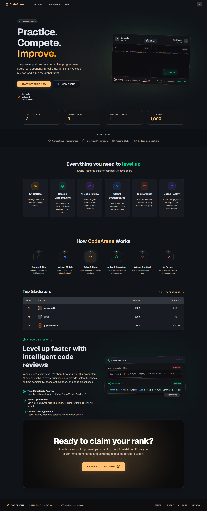
</details>

<details>
<summary><b>Dashboard</b></summary>
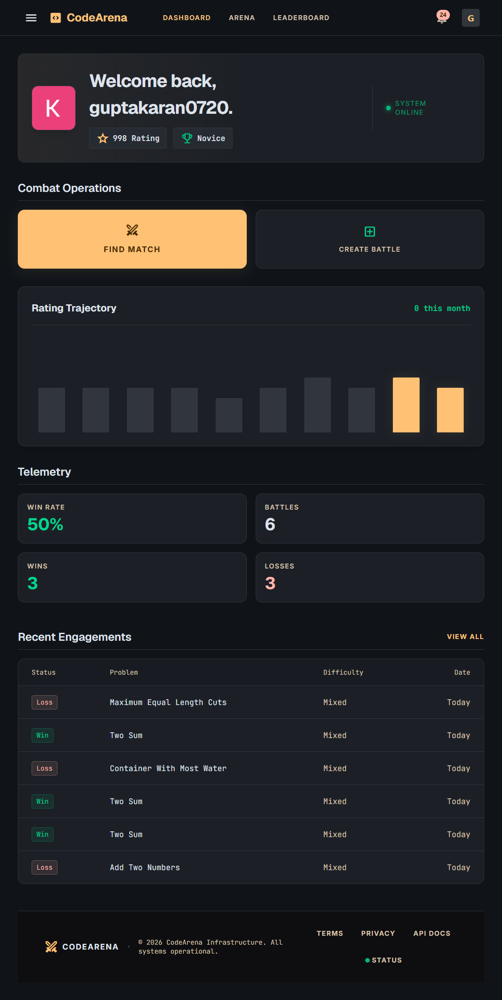
</details>

<details>
<summary><b>Live Battle Room</b></summary>
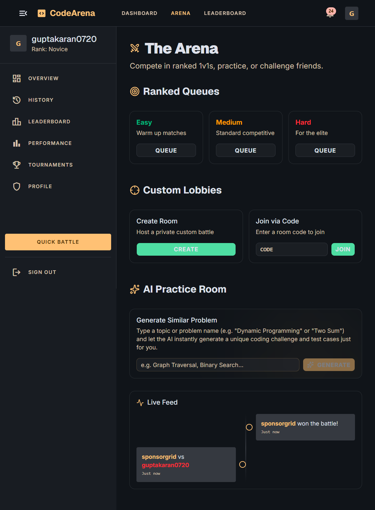
</details>

<details>
<summary><b>Global Leaderboard</b></summary>
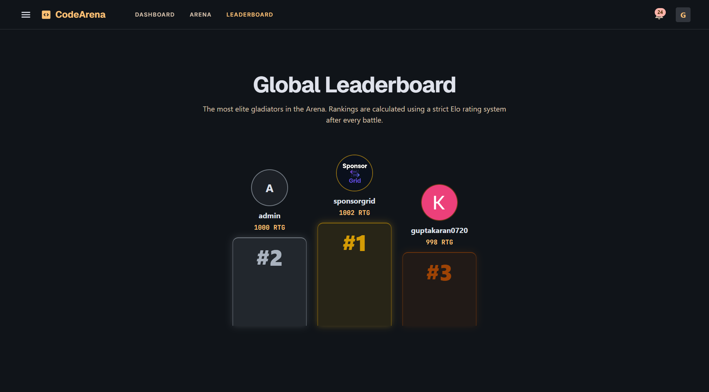
</details>

<details>
<summary><b>Profile</b></summary>
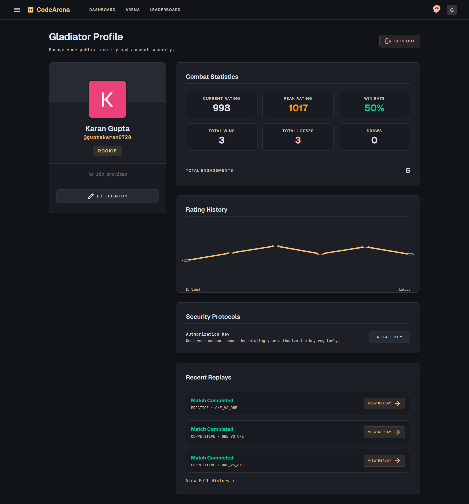
</details>

---


## 👤 Author

**CodeArena**

- Website: [https://guptakaran0720.vercel.app/](#)
- GitHub: [@guptakaran20](https://github.com/guptakaran20)

---

## ⭐️ Support

If you found this project helpful or use it for your interview preparation:
- Please give it a ⭐️ on GitHub!
- Fork and customize it.
- Open issues for bugs or feature requests.
